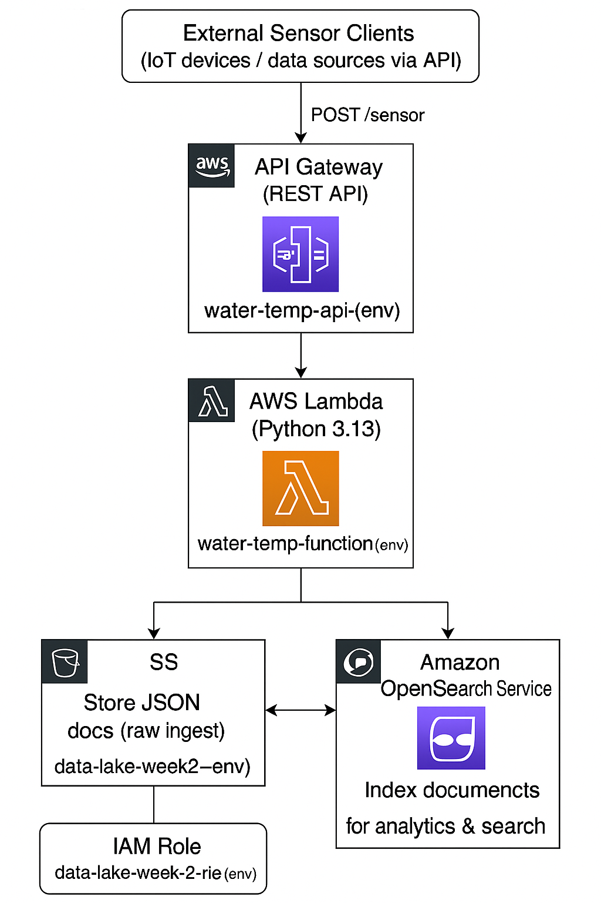

# OpenSearch Sensor Data Pipeline – Design Specification

## 1. Overview
This document outlines the technical design of a cloud-native data ingestion and indexing system built on AWS. The project receives temperature data from external sensor clients via an API, processes the data in real-time using AWS Lambda, stores raw JSON in Amazon S3, and indexes documents in Amazon OpenSearch Service for analytics.

---

## 2. Architecture Components

### High-Level Architecture Overview
```
┌─────────────────────────────────────────────┐
│           External Sensor Clients           │
│     (IoT devices / data sources via API)    │
└─────────────────────────────────────────────┘
                   │ POST /sensor
                   ▼
       ┌────────────────────────────┐
       │  API Gateway (REST API)    │◄────────────────────────────────────┐
       │  water-temp-api-{env}      │                                     │
       └────────────────────────────┘                                     │
                   │                                                      │
                   ▼                                                      │
       ┌────────────────────────────┐                                     │
       │  AWS Lambda (Python 3.13)  │                                     │
       │  water-temp-function-{env} │                                     │
       └────────────────────────────┘                                     │
                   │                                                      │
                   ├──────────────> S3: Store JSON docs (raw ingest)      │
                   │                   (data-lake-week2-{env})            │
                   │                                                      │
                   └──────────────> OpenSearch: Index documents           │
                                       (water-temp-domain-{env})          │
                                                                          │
┌─────────────────────────────┐          ┌──────────────────────────────┐ │
│     IAM Role (Lambda)       │◄────────► Grants access to S3 & ES      │ │
│  data-lake-week-2-role-{env}│          └──────────────────────────────┘ │
└─────────────────────────────┘                                           │
                                                                          ▼
                                                        ┌────────────────────────┐
                                                        │ Kibana / OpenSearch UI │
                                                        │ for analytics & search │
                                                        └────────────────────────┘
```



### 2.1 API Gateway
- **Service**: Amazon API Gateway (REST API)
- **Endpoint**: `POST /sensor`
- **CORS**: Enabled (Allow all origins)
- **Purpose**: Exposes a REST endpoint to receive temperature sensor data.

### 2.2 AWS Lambda Function
- **Runtime**: Python 3.13
- **Function Name**: `water-temp-function-{env}`
- **Handler**: `lambda.handler`
- **Environment Variables**:
  - `AWS_BUCKET_NAME`
  - `ENVIRONMENT`
  - `ES_DOMAIN_URL`
- **Responsibilities**:
  1. Parse incoming JSON
  2. Save data as a `.json` object to S3
  3. Index document into OpenSearch

### 2.3 S3 Bucket
- **Name Pattern**: `data-lake-week2-{env}`
- **Features**:
  - Versioning Enabled
  - Public Access Blocked
  - S3-Managed Encryption
  - Lifecycle Rules:
    - Expire after 30 days
    - Non-current versions cleanup after 7 days
    - Abort incomplete uploads after 7 days
  - Logging to control tower logs bucket

### 2.4 OpenSearch Service
- **Domain Name**: `water-temp-domain-{env}`
- **Version**: OpenSearch 2.17
- **Capacity**:
  - Data Nodes: 3 (`r5.large.search`)
  - Master Nodes: 3
- **Storage**: 10 GiB EBS (GP3)
- **Security**:
  - HTTPS enforced
  - Node-to-node encryption enabled
  - Encryption at rest enabled
  - Access via IP restriction + Lambda role

### 2.5 IAM Role
- **Name**: `data-lake-week-2-role-{env}`
- **Trusted Entity**: `lambda.amazonaws.com`
- **Managed Policies**:
  - `AWSLambdaBasicExecutionRole`
  - `AWSLambdaVPCAccessExecutionRole`
  - `AmazonS3FullAccess`
  - `AmazonESFullAccess`

### 2.6 Lambda Layer
- **Layer Name**: `water-temp-function-{env}-lambda-layer`
- **Content**: Requests, AWS4Auth (and other deps)
- **Bundling**: Uses Docker image to pip install into `/python`

---

## 3. Configuration Management
- `.env` file used in local development
- `common.py` handles:
  - Logging
  - Environment variable validation
  - Boto3 client instantiation
  - HTML email generation (for future use)

---

## 4. Data Flow

```
Client → API Gateway → Lambda Function
       ↘︎ S3 (JSON file)
       ↘︎ OpenSearch (Indexing)
```

---

## 5. Environment Support
- **Supported Environments**: `local`, `dev`, `sbx`, `uat`, `acpt`, `prod`
- **Qualifiers** used for synthesizer:
  - sbx: `tciedasbx0`
  - dev: `tciedadev`
  - uat/acpt: `openweather`
  - prod: `tciedaprod`

---

## 6. Security & Access
- API Gateway: No auth, CORS enabled
- OpenSearch: Public IP restricted, IAM policy for Lambda role
- S3: Access via IAM role + encryption & logging

---

## 7. Logging & Monitoring
- **Lambda**: 30-day log retention in CloudWatch Logs
- **Common.py**: Console logging with timestamps

---

## 8. Future Enhancements
- Add fine-grained access control to OpenSearch
- Use API Gateway models for schema validation
- Enable data validation and enrichment in Lambda
- Store metrics in CloudWatch and trigger alerts

